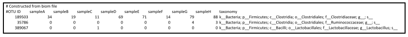

```{r setup, include=FALSE}
knitr::opts_chunk$set(echo = TRUE)
```


---
title: Visualizing QIIME data in R
author: Tonya Ward
hours: 3
---

------------

## Learning objectives  

* Make custom plots in R using QIIME data  

------------
## Visualizing QIIME data in R

### Loading tables in R 
If you remember we generated 3 types of tables with QIIME:  
* OTU table (.biom and .txt versions - rarefied and low-depth filtered)
* Alpha diversity table (.txt)
* Beta diversity tables (.txt)

#### OTU Table  

##### Format  

The first two lines include a spacer line detailing how the file was once a .biom format, and the column headers.  Note that these lines start with a '#', which usually represents a comment line (something the computer doesn't read), so we will have to pay attention to how R reads our OTU table.  

**Rows**  
OTU ID, which is a unique ID for each set of sequences that are 97% identical.   

**Columns 1 through the second last**  
Each column represents a sample. The numbers in each row correspond to the number of reads that mapped to the specified OTU ID in the first column.  

**Last Column**  
The assigned taxonomic identity for each OTU (e.g. For k__Bacteria; p__Bacteroidetes; c__Bacteroidia; o__Bacteroidales; f__Prevotellaceae; g__Prevotella; s__copri). k = kingdom, the p = phylum, c = class, o = order, f = family, g = genus and s= species.  
See example of the first 5 lines of an OTU table that is in the required format:   



### Loading OTU Table  
First, use the function `read.table()` to read in your OTU table. These various arguments are all set specifically for the format of your OTU table in .txt format.  

`comment =` is telling R what should be interpreted as a comment versus as a line of code. The default for this is the pound sign '#' but since we want the column header information we turn off the interpretation of comments using the option `comment = ''`  

`header =` is telling R whether the first line of code should be assigned as row 1 or as the column names. We set this to `TRUE` or `T`.  

`sep =` defines the field separator character which in this case is a tab, so `sep = '\t'`  

`skip =` tells R how many rows to skip when reading in the table. The default for this is 0, but in this case, we want to ignore the first line '# Constructed from biom file' so we skip the first line.  

`as.is =` controls the interpretation of character variables as a character string vs. as a factor. To avoid having thousands of levels associated with our taxonomy column, we specify `as.is=T`  

`check.names =` determines whether the names of variable in the data frame are syntactically valid. Because our sample names in our data set start with numbers, which would cause problems in R, we have to set `check.names=F`  

`row =` will tell R if we would like to set one of the columns to be the row names. In this case we would like to set the first column, which is the OTU IDs to be the row names. (row=1)  

You will have to change the name of the OTU table to be the name of your table.  
```{r}
#Set the working directory. This should be specific to your computer.
setwd("~/Desktop/lab-manual-master/")

# Now we can read in the table - This the the rarefied one
otu <- read.table("hmp_otu_2krare.txt", 
                  comment="", 
                  header=TRUE, 
                  sep="\t",
                  skip=1, 
                  as.is=TRUE, 
                  check.names=F,
                  row=1)

# Read in the low depth removed OTU table
otu_filt <- read.table("hmp_otu_2kfilter.txt", 
                  comment="", 
                  header=TRUE, 
                  sep="\t",
                  skip=1, 
                  as.is=TRUE, 
                  check.names=F,
                  row=1)
```
Remember, you can always find out more about a function by using the help() function or the ?. So, to find out about the `read.table()` function, you could do the following:  
```{r eval=F}
?read.table()
```

To find out information about our table we can use different functions. For example, we can find out the row names and column names using `rownames()` and `colnames()`, respectively. We can find the dimensions with `dim()`, and we can print the first couple of lines (default is 10) with `head()`.  We can also click on our table in the Environment panel to view the whole table.  
```{r, eval=F}
# View first 2 lines using head()
head(otu, n=2)

# View dimensions
dim(otu)

# Print row names (which are OTU IDs)
row.names(otu)

#Print column names (which are samples IDs the taxonomy header)
colnames(otu)
```

## Alpha Diversity File

Prior to plotting in R, we need to generate an alpha diversity table in QIIME.  This file will be the output of `alpha_diversity.py`, and will be a tab-delimited, plain text file. The format for the alpha diversity file is the following:

###Format
**Rows**

The rows are the sample IDs. 

**Columns**

Each column represents a diversity metric (e.g. `PD_whole_tree`, `simpson`, `shannon`, or `observed_species`). The numbers in each row correspond to alpha diversity estimate for the associated sample. 

###Loading Alpha Diversity
```{r}
# Read in the alpha diversity table
alpha <- read.table("hmp_alpha2krare.txt", 
                    sep='\t', 
                    header=TRUE, 
                    as.is=TRUE, 
                    check.names=FALSE,
                    row=1)
```
__Notice:__  
* We set the header to be the first row (alpha diversity metrics)  
* We set the rownames to be the first column (sample IDs)  

## Beta Diversity File  
Prior to plotting in R, we need to generate an a distance matrix generated by with QIIME. This file will be the output of `beta_diversity.py`, and will be a tab-delimited, plain text file. The format for the beta diversity file is the following:  

###Format   
**Rows**  
The rows are the sample IDs.   
**Columns**  
Each column is also a sample ID and the distances from one sample to another are the values.  

You should have one for each metric you used (Unweighted UniFrac, Weighted UniFrac, and Bray-Curtis).  
```{R}
# Load the beta diversity matrix, notice that we use read.table(),
# but then change from a dataframe to a matrix with as.matrix()
beta <- as.matrix(read.table("unweighted_unifrac_dm.txt", 
                             sep = "\t", 
                             header=T, 
                             row = 1, 
                             as.is = T, 
                             check.names = F))
```
__Notice:__  
* We set the header to be the first row (These are sample IDs)  
* We set the rows names to be the first column (These are also sample IDs)  

## Metadata File   
Your metadata file (also called a mapping file) is a data table containing information about the samples in your dataset. In order to assess how taxa correlate with variables of interest (e.g. country, body site, species, ecoregion, BMI, etc.), we need to have that information about our samples accessible. The metadata file for our data set is `HMP_metadata.txt`.  

### Format  
**Rows**   
The actual mapping file starts with '#SampleID' as the first header. This contains a the sample IDs, which are unique IDs for each sample in the dataset. To work in QIIME, this must have a '#' at the start.  Remember that '#' usually represents a comment line (something the computer doesn't read), so we will have to pay attention to how R reads in this file.  

**Columns 1 - last column**  
Each column represents a description of the sample.  It can be anything including details about the patient, person, animal or location the sample was taken from. This file should contain no spaces or empty columns/rows.  

### Loading Metadata File  
We load the metadata table just like the OTU table, but notice that the `skip` parameter is left out, because the metadata table doesn't have the additional first line that the OTU table has.  
```{r}
metadata <- read.table('HMP_metadata.txt', 
                       header=T, 
                       sep='\t', 
                       check.names=F, 
                       comment='',
                       row=1)
```
__Notice:__  
* We set the header to be the first row (These are sample IDs)  
* We set the rows names to be the first column (These are also sample IDs)  
* We told R to ignore the '#' in the first line  

What are the dimensions of the metadata file? How would you find this out? (We went over this in the OTU table section, above).  

What variables do we have available for this data set? They are the column headers. You can find this out using `colnames()`.  
```{r}
colnames(metadata)
```

The mapping file is what we use in the majority of our QIIME commands so it contains information about the sequencing files (e.g. `BarcodeSequence`, `LinkerPrimerSequence`, `FASTA_FILE`, and `SRS_SampleID`), that are not necessary for our analysis. We need the sample IDs to match our variables to the microbial abundance information contained in our OTU table.   

Each column in this file is a variable (also called a covariate), which can be defined as being continuous or categorical. Categorical variables are described as factors, the levels of which are the categories within it. You can view the number and identity of levels for a categorical variable by calling it, or using the `str()` function.  
```{r, eval=F}
# View the 'Sex' column of the mapping file dataframe
metadata[,'Sex']
```

Notice how we wrote the command to access the 'Sex' column.`[,]` is a way to specify rows and columns or a matrix or dataframe. Inside the square brackets, the first index specified is the row, and the second (after the comma) is the column. So what we wrote was, "display all the rows (left blank), in the 'Sex' column, or `metadata[,'Sex']`.  We can also use the row number or column number `metadata[,4]`.  

Because our mapping file is loaded as a dataframe, we can also do this using the "$".  
```{r, eval =F}
# Notice that using "$" only works for dataframes and not matrices
metadata$Sex

# The class function will also tell you whether your variable is 
# a factor, numeric, character, etc.
class(metadata[,'Sex'])
```

## Formatting Your Data

In order to assess relationships between sample information in our OTU table, alpha diversity and beta diversity, we need to match the order of our data frames. For that we will use the `intersect()` function. Because we have potentially removed one or more samples from our OTU table during rarefaction, filtering or other manipulations, we can first define the subset of samples in all of our tables.  

`intersect()` can retain all the sample IDs that are in the OTU table and also in the metadata file. We can then subset all of our tables to keep just those samples.

```{r}
# First, define all the samples in the OTU table.
# Remember, when we load in the OTU table, samples are columns
# Remember, the last column in the OTU table is taxonomy (don't use it)
samples1 <- colnames(otu)[1:(ncol(otu)-1)]

# Now let's see what the intersect with the  metadata row names are
IDs_Keep <- intersect(samples1, rownames(metadata))

# Now let's filter the metadata to keep only those samples
# We tell R to make a new data frame that only has the rows we want
metadata <- metadata[IDs_Keep,]

# Now let's filter the OTU table to keep just the intersecting samples
# We will store it as a new otu table (incase we need the old one)
# Remember, OTU table has columns as samples!
# This will also remove the taxonomy, because it's not a sample ID we want
otu2 <- otu[,IDs_Keep] #for rarefied
otu_filt2 <- otu_filt[, IDs_Keep] #for low depth removed

# To add the taxonomy back, we can use the taxonomy info from
# the orignal table
otu2$taxonomy <- otu$taxonomy
otu_filt2$taxonomy <- otu_filt$taxonomy 

# Now let's filer the alpha diversity table to keep those samples too
# Alpha diversity has the samples as row names
alpha <- alpha[IDs_Keep, ]

# Now let's filter the beta diversity table to keep those samples too
# Beta diversity has the samples as row names AND column names
# We must filter both the rows and columns
beta <- beta[IDs_Keep,IDs_Keep]
```
``` {r, eval=F}
#Let's check to make sure the samples match  
as.character(rownames(metadata)) == colnames(otu2)[1:(ncol(otu2)-1)]
```
``` {r}
#Let's see how many samples are in the otu table (columns) and mapping

ncol(otu) #There should be one more here because there is also a taxonomy row
nrow(metadata)
```

#Plotting in R

##ggplot  
To visualize our data in R we will use the package `ggplot2()`. This package allows us to make  detailed and specific visualization needed to best show our results. Let's start with the packages we need to load.  If these are not installed you can install them first with `install.packages()`.  
```{r}
library(ggplot2)
```
### ggplot input  
ggplot likes to have all the data for the plot in one table. Specifically, it like to be able to access the information needed by using columns. Let's use alpha diversity as an example. We will use our alpha diversity measurements as the input data for our examples.

First we have to combine our alpha diversity results with the metadata that tells us which body site each samples comes from. __Make sure you have your metadata and alpha diversity tables loaded and that the samples are subsetted and in the correct order for both tables.__  
```{r}
# We will make a copy of our metadata to work with
combined_alphadata <- metadata

# Because our sample order is the same, we can make a new column in the table
# This column will contain all the Shannon index measurements for the samples
combined_alphadata$shannon <- alpha$shannon
```

### ggplot Format  
ggplot creates plots in layers. First we make the base layer with `ggplot()` and then add on different types of plotting types and aesthetics.  

### Aesthetic Mapping  
In ggplot, aesthetic means __something you can see__. For example:  
*   position (i.e., on the x and y axes)  
*   color (“outside” color)  
*   fill (“inside” color)  
*   shape (of points)  
*   linetype  
*   size  

### Geometic Objects (geom)
Geometric objects are the actual characters we put on a plot. For example:  
*   points (e.g. geom_point, for scatter plots)  
*   lines (e.g. geom_line, for line graphs)  
*   boxplot (e.g. geom_boxplot, for box plots)  

## Plotting  
Before we plot our data, we need to think about what type it is.  In the first example the independent variable will be "BodySite", which is discrete. Our dependent variable, alpha diversity (Shannon Index), falls in a range of values.  We could use a bar chart, but a box plot will tell us more about the dataset.

### Box Plots  
If we remember, Box plots consist of several features: **the box**, which extends from the first quartile (Q1) to the third quartile (Q3), respectively, with the median (Q2) depicted by a vertical line within the box; **whiskers**, which extending vertically from the box and indicate the range of variability outside of the upper and lower quartiles; and **outliers**, which are individual points outside of the box and whiskers.

It is important to note that box plots are good for **non-parametric** data. They display variation in samples of a statistical population without making any assumptions of the underlying statistical distribution. The spacing between the interquartile range of the box indicates the degree of dispersion (spread) and skewness in the data.  

#### Plotting Example 1 - Discrete X-Variable
```{r, fig.width=5,fig.height=2.5}
ggplot() + 
  geom_boxplot(data=combined_alphadata, aes(x= BodySite, y= shannon))
```
__Notice:__  
*   We created the base layer with `ggplot()   
*   We add the next layer with `+`   
*   We added a boxplot with `geom_boxplot()`   
*   We specified which table to use with `data=`   
*   We specified the aesthetics within `aes()`   
*   The dependent variable (y) is called by its column name  
*   The independent variable (x) is called by its column name   

### Scatter Plots  
In the second example the independent variable will be "Age", which is continuous. Our dependent variable, alpha diversity (Shannon Index), falls in a range of values.  Therefore we can use a scatter plot to look for trends.

#### Plotting Example 2 - Continuous X-Variable  
```{r, fig.width=5,fig.height=2.5}
ggplot() + 
  geom_point(data=combined_alphadata, aes(x= Age, y= shannon))
```
__Notice:__  
*   We created the base layer with `ggplot()  
*   We add the next layer with `+`  
*   We added a scatter plot with `geom_point()`  
*   We specified which table to use with `data=`  
*   We specified the aesthetics within `aes()`  
*   The dependent variable (y) is called by its column name  
*   The independent variable (x) is called by its column name  

### Other Plotting Examples  
#### Plotting Example 3 - Wrong Plot Types  
```{r,  fig.width=5,fig.height=2.5}
ggplot() + 
  geom_boxplot(data=combined_alphadata, aes(x= Age, y= shannon))
```
__Notice:__   
*	We tried to make a boxplot with continuous data. It clearly doesn't work well!  

#### Plotting Example 4 - Adding in more aesthetics
```{r, fig.width=5,fig.height=3.5}
# Specifying the color changes the outline color 
ggplot() + 
  geom_boxplot(data=combined_alphadata, aes(x= BodySite, y= shannon, color=BodySite))

# Specifying the fill changes the interior color
ggplot() + 
  geom_boxplot(data=combined_alphadata, aes(x= BodySite, y= shannon, fill= BodySite))

# Specifying the fill outside of aes() changes it for all x values
# You must pick an exact color if you'd like to do this
ggplot() + 
  geom_boxplot(data=combined_alphadata, fill = "red", aes(x= BodySite, y= shannon))

# Specifying the theme changes the background
ggplot() + 
  geom_boxplot(data=combined_alphadata, fill="red", aes(x= BodySite, y= shannon)) +
  theme_bw() #this is the black and white theme

# We can pick any colors we want to fill by
ggplot() + 
  geom_boxplot(data=combined_alphadata,  aes(x= BodySite, y= shannon, fill=BodySite)) +
  theme_bw() +
  scale_fill_manual(values= c("blue", "green", "pink", "grey", "yellow", "red", "purple", "lightblue", "white"))

```

#### Plotting Example 5 - Adding Layers of Plots  
```{r, fig.width=5,fig.height=3}
# Add a scatter on top of the boxplots 
# To do this, we have to specify the data frame for each layer and the aes() for each layer
ggplot() + 
  geom_boxplot(data=combined_alphadata, aes(x= BodySite, y= shannon, color=BodySite)) +
  geom_jitter(data=combined_alphadata, aes(x=BodySite, y=shannon, color=BodySite))


# We can decrease the jitter on the scatter plot with width=
ggplot() + 
  geom_boxplot(data=combined_alphadata, aes(x= BodySite, y= shannon, color=BodySite)) +
  geom_jitter(data=combined_alphadata, width= 0.1, aes(x=BodySite, y=shannon, color=BodySite))


# If all the data for your entire plot will use the same data frame you can specify that in the ggplot()
ggplot(data=combined_alphadata) +
  geom_boxplot(aes(x= BodySite, y= shannon, color=BodySite)) +
  geom_jitter(width= 0.1, aes(x=BodySite, y=shannon, color=BodySite))


# If all the data and aes() for your entire plot will be the same, you can specify it in ggplot()
ggplot(data=combined_alphadata, aes(x=BodySite, y=shannon, color=BodySite)) +
  geom_boxplot() +
  geom_jitter(width= 0.1)


# You can make this specific to just one plot layer
# We are using color ONLY in the geom_jitter here
ggplot(data=combined_alphadata, aes(x=BodySite, y=shannon)) +
  geom_boxplot() +
  geom_jitter(width= 0.1, aes(color=BodySite))
```


# Alpha Diversity Differences in R

## Input data

### Alpha Diversity Table and Metadata

Your alpha diversity table and metadata table should be loaded. Remember to subset the tables so that the samples IDs are correct and in the same order. In the "Loading Tables in R" section we saved these tables as `alpha` and `metadata`

Now we need to pick which covariate we would like to use for the plot, and which alpha diversity metric we would like to visualize. We will use "Sex" and the "shannon" diversity metric.

## Testing for Differences

### *t*-Tests  
A *t*-test can be used to determine if two sets of data are significantly different from each other based on the population means. It assumes the data are normally distributed. Although it is typically assumed that data of a large enough sample size are normally distributed, this is not always the case.

### Testing for Normality  
Let's see if our data are normally distributed using the hist() function. We will do this for each group in the covariate we are testing (in this case, 'sex').  
```{r, fig.width=6,fig.height=3.5}
# We will find the samples that are male in the metadata
males.ix <- metadata$Sex == 'male'
# And subset the alpha table to include only those, and store it as 'males'
males <- alpha[males.ix,]

# We will do the same for females
females.ix <- metadata$Sex == 'female'
females <- alpha[females.ix,]

# Now we can plot the histograms
hist(females$shannon, xlab="Alpha Diversity", main='Females')
hist(males$shannon, xlab="Alpha Diversity", main='Males')
```

Do those look normally distributed? For the most part they do, but it is sometimes hard to tell. The best way to determine if your data are normally distributed is to do a statistical test. 

### The Shapiro-Wilk Normality Test  

This test can be run with the `shapiro.test()` function in R. It will generate an approximate p-value, which is adequate in assessing normality. In this case, **p-values less than 0.1 indicate the data are significantly different from normal distribution**. We will run this test for each group in our covariate of interest.

```{r}
shapiro.test(females$shannon)
shapiro.test(males$shannon)
```

Based on the results, should you run a *t*-test?

### Mann-Whitney U Test

Based on these results, it is better to test for differences in our data using a statistical test that does **not** require normal distributions. The Mann-Whitney U test (aka Wilcoxen-rank_sum test) is smilar to the *t*-test. The null hypothesis of this test would be that that groups means differ only by chance. We can do a Mann-Whitney U test using the `wilcox.test()` function in R.

```{r}
wilcox.test(females$shannon, males$shannon,  na.rm=TRUE)
# This is telling are to use a wilcox test to comapre females
# and males for the diversity metric we set earlier. It is also
# telling R to remove any NAs (missing data)

# Note that you would run a t-test in the same way, only using 
# the t.test() function
```

The p-value here, which is less than an alpha of 0.05. This means that we **reject** the null hypothesis that these two body sites are **not significantly different** for this metric of alpha diversity.

We can also see what the box plot looks like.  
```{r, fig.width=6,fig.height=2.5}
alpha2 <- alpha
alpha2$Sex <- metadata$Sex

ggplot(data=alpha2, aes(x=Sex, y= shannon)) + 
  geom_boxplot(outlier.color = NA) + # removes outlier points becuase we add in the jitter anyways
  geom_jitter(width= 0.1, aes(color=Sex)) +
  theme_bw() +
  guides(color=F) #because the x-axis is already labeled
```

In our example we only have two groups, 'male' and 'female'. If we used a different covariate, like 'BodySite' (which contains 5 groups) we would have 10 tests to do pairwise. Luckily, for loops can come to the rescue! This loop will perform the `wilcox.test()` on every unique combination of groups in the covariate.  
```{r}
# First let's set all the groups available for the variable we care about
# In this case we will use BodySite instead of what we set as cov1 
# (because sex only has two values)
groups <- unique(metadata$BodySite)

# We create empty vectors to store the pair-wise pvalues and the 
# groups tested (names)
pw.pvalues <- NULL
pw.names <- NULL

# We set two counters, 'i' starts at 1 and goes until one less than
# the number of groups. 'j' will start at 2, and go until the full 
# number of groups. This will end up comparing: 1 vs 2, 2 vs 3, 
# 3 vs 4, and so on.
for(i in 1:(length(groups) - 1)){
			for(j in (i+1):length(groups)){
			  #we use this to pick the groups assigned to 'i'
				ix.metric.i <- metadata$BodySite == groups[i]
				#and this for 'j'
				ix.metric.j <- metadata$BodySite == groups[j]
				#this stores the pvalue from the test
				pvalue <- wilcox.test(alpha[ix.metric.i,"shannon"], 
				                      alpha[ix.metric.j,"shannon"])$p.value 
				#appends the new p-value to the list
				pw.pvalues <- c(pw.pvalues, pvalue) 
				#sets the names of the groups tested
				test.name <- paste(groups[i], "_vs_", groups[j],sep='')
				#appends the names of the groups tested to the list
				pw.names <- c(pw.names, test.name) 
			}
}
names(pw.pvalues) <- pw.names

pw.pvalues
```

### False Discovery Rate Correction

When we use the 'sex' covariate, we only have one test to perform. If we are comparing more than two groups and we are running multiple tests we have to correct of the number of comparisons we are making.  We do this with the `p.adjust()` function. This will correct for type I errors, which are rejections of a true null hypothesis (also known as a false positive).

```{r}
# We will correct using 'fdr', which is the false discovery rate
fdr.pvalues <- p.adjust(pw.pvalues,'fdr')
fdr.pvalues
```

Now we can view the relative p-values for each pairwise comparison, and we can save this table as a file.

```{r, eval=F}
# sink() will write whatever is listed below it to a file.  
# You close that file by listing sink() again.
sink("alpha_stats.txt")

cat("\nNumber of samples in each group:\n")
print(table(metadata$BodySite))
#This prints a table of the number of samples at each body site

cat("\nMean Alpha Diversity:\n")
print(tapply(alpha$shannon, metadata$BodySite, mean))
# This will get the mean of alpha diversity at each body site
# by using tapply() to apply the mean function across the alpha
# table (subsetted into body site groups)

cat("\nMedian Alpha Diversity:\n")
print(tapply(alpha$shannon, metadata$BodySite, median))
# This will get the median of alpha diversity at each body site

cat("\nStandard Deviation:\n")
print(tapply(alpha$shannon, metadata$BodySite, sd))
# This will get the standard deviations of alpha diversity at 
# each body site

cat("\nPairwise Mann-Whitney-Wilcoxon Tests were performed.\n")
cat("Pairwise p-values are:\n")
print(pw.pvalues)
		
cat("\nFDR-corrected pairwise p-values are:\n")
print(p.adjust(pw.pvalues,'fdr'))

sink()
```

We can also see what the box plot looks like.

```{r, fig.width=6,fig.height=3.5}
alpha2 <- alpha
alpha2$BodySite <- metadata$BodySite

ggplot(data=alpha2, aes(x=BodySite, y= shannon)) + 
  geom_boxplot() +
  geom_jitter(width= 0.1, aes(color=BodySite)) +
  theme_bw()
```

We can also print this plot to a pdf with the `pdf()` function followed by `dev.off()` to close the pdf.
```{r, fig.width=6,fig.height=3.5}
plot_output <- ggplot(data=alpha2, aes(x=BodySite, y= shannon)) + 
  geom_boxplot() +
  geom_jitter(width= 0.1, aes(color=BodySite)) +
  theme_bw() +
  scale_x_discrete(labels=c("ear fold", "vagina", "saliva", "stool", "plaque")) +
  guides(color=F) #because they are labeled at the x- axis 

pdf("Alpha_Diversity.pdf", height=4, width=6)
plot(plot_output)
dev.off()

```
# Taxa Summary Plots in R
Visualizing which taxa are in your samples can be an effective way to see patterns in the data. Here we will learn how to make taxa summary plots based on your input OTU table, a covariate of interest, and other specified parameters. 

## Input data

### OTU table and Metadata

Your OTU table should be loaded and we can use the filtered version. Your metadata file should also be loaded. Remember to subset the tables so that the samples IDs are correct and in the same order. In the "Loading Tables in R" section we saved these tables as `otu2` and `metadata`

## Manage Taxonomy
We want to set a taxa level by number: 
1 = kingdom  
2 = phylum  
3 = class  
4 = order  
5 = family  
6 = genus  
7 = species  

Let's work with phylum (level 2). The taxa are listed with a letter representing the level followed by two underscores, and a semicolon separating each level (k__kingdom; p__phylum; ...). We will do some string parsing to replace the full taxonomy label with the appropriate level. 
```{r}
# In this example we are using 2 (or phylum). 
# This can be for any level you want.
level = 2

# First we make an empty table (array) for our new names
# The array will have the number of rows equal to the number of OTUs in the table
# and one column for each taxonomy level 
names_split <- array(dim=c(length(otu_filt2$taxonomy), level))

# We will store our taxonomy as a list of names
otu_names <- as.character(otu_filt2$taxonomy)

# Then we run through each name and split based on the level we are 
# interested in. We make a for loop to split every name stored in 
# otu_names. strsplit() splits the string (otu_names[i]) at ";". 
# This retains all the levels as separate strings. head() takes the
# first items (the total will be the number you specified with level)
# from the string split output and stores it in the names_split 
# array at the specied row.
for (i in 1:length(otu_names)){
    names_split[i,] <- head(strsplit(otu_names[i], "; ", fixed=T)[[1]], n=level)
}

# Now we will collapse the strings together into one string
otu_names <- apply(names_split, 1, function(x) paste(x[1:level], sep = "", collapse = ";"))

# Replace the old taxonomy with the truncated version, as a new table
otu_filt3 <- otu_filt2
otu_filt3$taxonomy <- otu_names
```

Now we want to consolidate our OTU table by the taxa levels we've set, just like we learned in the loading and manipulating tutorial. We will use the `aggregate()` function.  
```{r}
# Get the number of samples (the last column is taxonomy)
sample_no <- ncol(otu_filt3)-1

# Collapse the otu table and save it as a new table 
otu_filt3 <- aggregate(otu_filt3[,1:sample_no], by=list(otu_filt3$taxonomy), FUN=sum)

# Name the first column taxonomy because R stores the column
# we told it to aggregate by as the first column
names(otu_filt3)[1] <- "taxonomy"

# We can see that the consolidating worked by checking how many rows we 
# now have - that's how many phyla there are (level=2) 
nrow(otu_filt3)
```

Let's replace the rownames with the taxonomy, and get rid of the taxonomy column.  
```{r}
# Set rownames as taxonomy
rownames(otu_filt3) <- otu_filt3$taxonomy

# Keep all columns in the otu table that do NOT (!) have the column 
# header "taxonomy"
otu_filt3 <- otu_filt3[,!names(otu_filt3) == "taxonomy"]
```
## Filtering OTUs and Samples

Let's filter the OTU table to remove low abundant OTUs, and keep only those in at least 5% of samples.  
```{r}

# Filter OTUs that are in low abundance
# Change those less than 1/1 millionth of read depth to 0

# colSums(otu_filt3) takes the column sums of each column (sample) 
# sum(colSums(otu_filt3)) takes the sum off all the columns (total counts)
# sum(colSums(otu_filt3))/1000000 divides by 1 million 
# otu_filt3[otu_filt3 < sum(colSums(otu_filt3))/1000000] will set the values less than that number to TRUE 
# otu_filt3[otu_filt3 < sum(colSums(otu_filt3))/1000000] <- 0 will set the TRUEs to 0
otu_filt3[otu_filt3 < sum(colSums(otu_filt3))/1000000] <- 0

# Change singletons to 0 (needed for low depth OTU tables)
# otu_filt3 < 2 sets all values less than 2 to TRUE
# otu_filt3[otu_filt3 < 2] <- 0 sets all the TRUEs to 0
otu_filt3[otu_filt3 < 2] <- 0

# Filter the OTU table to keep OTUs in at least 5% of samples

# otu_filt3 > 0 sets the values greater than 0 to TRUE
# rowSums(otu_filt3 > 0) sums the TRUEs in each row (number of samples OTU is in)
# ncol(otu_filt3) find the number of columns
# (0.05*ncol(otu_filt3)) multiple that by 0.05
# otu_filt3[rowSums(otu_filt3 > 0) > (0.05*ncol(otu_filt3)),] keep only rows where occurance is greater than 5% of samples
otu_filt3 <- otu_filt3[rowSums(otu_filt3 > 0) > (0.05*ncol(otu_filt3)),]
```

## Calculating relative abundances
We took out some taxa when filtering, so we need to convert count into the relative abundance of that sample. To do this, we will use a for loop

```{r}
# We want to use all the columns (since we already took out taxonomy)
for(i in 1:ncol(otu_filt3)){
  otu_filt3[,i] <- otu_filt3[,i]/sum(otu_filt3[,i])
}
```

In order to make our OTU table and results more easily compatible with our metadata, we want the sample IDs as the rows and the taxa as the columns. We'll use the function `t()` to transpose the data frame. We can then make a column SampleID that will be useful later. 

```{r}
# Transpose as a data frame
otu_filt3 <- data.frame(t(otu_filt3))

# Make a column that is the Sample IDs (which are the rownames)
otu_filt3$SampleID <- rownames(otu_filt3)

# Let's save a backup of this filtered OTU table
otu_backup <- otu_filt3
```

If you remember, `ggplot` likes to have all the data in one table. Now we will use a function called `melt()` from the library `reshape2` to convert our data frame into three columns: one that has the sample ID, one that has taxa IDs, and one that has the relative abundances of the taxa in our sample. We'll also use the package `plyr` for it's function `ddply()` to aggregate our data nicely.

Before we can move forward, you must get the packages needed to run the functions we will use. You can install packages with the `install.packages()` function.

```{r}
#You'll want to install these packages if you don't already have them
library(reshape2)  
library(plyr)

otu_filt3 <- melt(otu_filt3, id.vars = "SampleID", 
            variable.name = "Taxa", 
            value.name = "RelativeAbundance")
```

## Plotting
Now we have a filtered table with three columns with which we can make a basic taxa summary plot (just grouped by sample ID). We'll use `ggplot`. 

```{r, fig.width=6,fig.height=3.5}
library(ggplot2)
# This will make a plot with the OTU table (otu), using the column 
# headers specified
ggplot(otu_filt3, aes(x = SampleID, y = RelativeAbundance, fill= Taxa)) + 
  geom_bar(stat = "identity", position="fill") +   # This makes it a bar plot (geom_bar())
  scale_x_discrete(labels = NULL)    #This takes off the x-labels (too hard to read)
```

This plot is kind of messy!  There are so many samples you can't easily see one sample from another.  

## Adding Metadata
Let's try piloting by a covariate. The easiest way to do that is to simply add our metadata values to our table. More columns means more potential variables to plot by. Let's go back to our full, filtered OTU table, melt it and then add metadata.

```{r}
otu_filt3 <- otu_backup
otu_filt3 <- melt(otu_filt3, 
            id.vars = "SampleID", 
            variable.name = "Taxa", 
            value.name = "RelativeAbundance")
```

Now we can add in our metadata, using the function `merge()`. First let's make sure we have the covariates/header names we think we do, and we can rename any that aren't right, and only keep the ones we're interested in. If you're looking at real metadata, you'll have a much longer list than the tutorial files. 

```{r}
colnames(metadata)

# We only want to keep "Sex", "BodySite", and 
# "Description", which is the area of the body

#This will keep only the columns with the headers we want
columns_keep <- c("Sex","BodySite","Description")
metadata2 <- metadata[,columns_keep]

# Now we merge covariates to sample ids
# First we need to make a column that is the sample IDs in the
metadata2$SampleID <- rownames(metadata2)

# This will drop any samples in the mapping file that aren't in the OTU table
otu_filt3 <- merge(otu_filt3, metadata2, by="SampleID")
```

Now we can plot according to body site.
```{r, fig.width=7, fig.height=3.4}
ggplot(otu_filt3, aes(x=BodySite, y=RelativeAbundance, fill=Taxa)) +
  # using position="fill" makes sure it sums to 1
  geom_bar(stat ="identity", position="fill") 

# We will want to shorten the x-labels.
# We can even split our data up by sex using this method, 
# using an option called facet_grid(): 
ggplot(otu_filt3, aes(x=BodySite, y=RelativeAbundance, fill=Taxa)) + 
  geom_bar(stat ="identity", position="fill") +
  facet_grid(.~Sex) + # This will separate by sex
  scale_x_discrete(labels=c("elbow", "mouth", "nose","throat","skin", "stool", "tongue", "vagina", "v.fornix"))    # This relabels the x axis
```

## Plot Specific Taxa
We can also plot just specific taxa. For that, we can use the aggregated relative abundance table `otu` from the `sex` in the example above, and pull out a subset of the taxa we're specifically interested in. You'll need the exact taxa labels from the table to match. Say we want to look at Firmicutes and Actinobacteria: 

```{r, fig.width=6,fig.height=2.5}
# If we don't remember the spelling, we can print all the taxa and 
# copy and paste: 
unique(otu_filt3$Taxa)

# Let's subset to just Bacteroidetes and Actinobacteria
taxaList <- c("k__Bacteria.p__Bacteroidetes", "k__Bacteria.p__Actinobacteria")

# Let's make a new subsetted table that is just those phyla
filtered <- subset(otu_filt3, is.element(otu_filt3$Taxa, taxaList))
```

We plot things the same, making sure **not** to use the option `position="fill"`, since our abundances now should **not** add up to 1. Let's make our labels a little nicer, as well. 

```{r, fig.width=6,fig.height=2.5}
ggplot(filtered, aes(x = Sex, y = RelativeAbundance, fill=Taxa)) + 
  geom_bar(stat="identity") + 
  labs(y = "Relative Abundance") + 
  scale_fill_discrete(labels = c("Actinobacteria", "Bacteroidetes")) + 
  scale_x_discrete(labels = c("Female", "Male"))
```

There are almost unlimited parameters that you can play with to change the actual look of your plots.  Below we use `theme_bw()` to make the background white, and modified the colors by making a color variable `cols` that we use to color the different taxa with `scale_fill_manual()`. 
```{r, fig.width=6,fig.height=2.5}
cols <- c("purple","yellow")

#Note that we have to use scale_fill_manual() instead of scale_fill_discrete 
# to specify colors
ggplot(filtered, aes(x = Sex, y = RelativeAbundance, fill=Taxa)) + 
  geom_bar(stat="identity") + 
  labs(y = "Relative Abundance") + 
  scale_x_discrete(labels = c("Female", "Male")) +
  theme_bw() + 
  scale_fill_manual(labels = c("Actinobacteria", "Bacteroidetes"), values=cols)
```


# Differentiated OTUs in R
We can test for taxa or OTU that are differentially abundant across sample types. To do this, we need to first transform our data out of the simplex. This means we want to go from working with compositional data to non-compositional data.

## Inputs

The input data you need include the metadata and your OTU table that has low depth samples removed. Don't use the rarefied OTU table. The tables should be subsetted and ordered for sample ID.  

First we will take the taxonomy out of the OTU table, filter low abundant OTUs and low occurring OTUs:  
```{r}
# We can store taxonomy and which OTUs they are to use for later
# drop=F makes sure it stays as a table
taxonomy_table <- otu_filt2[,"taxonomy",drop=F] 

#Keep only the samples, drop taxonomy from table
otu_filt3 <- otu_filt2[, ! names(otu_filt2) =="taxonomy"]

#Filter OTUs that are in low abundance
#Change those less than 1/1 millionth of read depth to 0
otu_filt3[otu_filt3 < sum(colSums(otu_filt3))/1000000] <- 0

#Change singletons to 0 (needed for low depth OTU tables)
otu_filt3[otu_filt3 < 2] <- 0

#Filter the OTU table to keep OTUs in at least 5% of samples
otu_filt3 <- otu_filt3[rowSums(otu_filt3 > 0) > (0.05*ncol(otu_filt3)),]
```

Now we will transform the data using a centered log-ratio transformation. This needs the `robCompositions` package.
```{r}
library(robCompositions)
#Convert any 0 to 0.65 to allow for CLR transform
#Ref: Palarea-Albaladejo J, et al. 2014. JOURNAL OF CHEMOMETRICS. A bootstrap estimation scheme for chemical compositional data with nondetects. 28;7:585–599.
otu_filt3[otu_filt3 == 0] <- 0.65
    
#Centered log-ratio transform for compositions
#Ref: Gloor GB, et al. 2016. ANNALS OF EPIDEMIOLOGY. It's all relative: analyzing microbiome data as compositions. 26;5:322-329.

#convert to samples as rows
otu_table <- t(otu_filt3)

#Centered log-ratio tranform the data 
otu_table <- cenLR(otu_table)$x.clr  
```

## Test For Differences  

Now our otu table has samples as rows and OTUs as samples. We can now loop through the OTUs and test for differences according to our metadata. Lets test for differences by bodysite. Because we transformed our data, we can now use parametric tests to look for differentiated OTUs. We can use ANOVA or t-test depending on the number of groups to test.  
```{r}
# Let's test the first OTU (first column) in the OTU table
# What is the name of this OTU? We can look it up in our table
# We pick the row we want using the otu id in the column
this_taxa <- taxonomy_table[colnames(otu_table)[1],"taxonomy"]
this_taxa

# Now lets run the test using the first column and according to bodysites in the metadata
aov_test <- aov(otu_table[,1] ~ metadata$BodySite)
summary(aov_test)
```

The output from `aov()` is more complicated than `kruskal.test()`. `aov()` output is a list that includes information about the degrees of freedom (`Df`), the Sum of Squares (`Sum Sq`), the Mean Square (`Mean Sq`), the F statistic/ratio (`F value`); and the P-value (`Pr(>F)`). For now, we are interested in the **p-value**, which can be indexed from `summary(aov_test)` with `summary(aov_test)[[1]][1,5]`.  
```{r}
summary(aov_test)[[1]][1,5]
```

Let's plot this example and see what it looks like.
```{r, fig.width=6,fig.height=3.5}
# Because ggplot likes to have all the data in one table, let's make a new table to plot with
plot_table <- data.frame(otu_table)
#Note that this will store and x infront of all the numerical column names
plot_table$BodySite <- metadata$BodySite

#store which column (header) you want to plot 
this_otu <- colnames(plot_table)[1]

# We can also store its name
# will split the taxonomy based on the ";"
# Then take the last two values (genus and species) to shorten the name
name = strsplit(this_taxa, ";", fixed=T)[[1]]
names_tail = tail(name, n=2)

# This will plot the transformed abundnces for each body site
# Note that we have to use aes_string() because we are filling in the y column header with a string
ggplot(plot_table) +
  geom_boxplot(aes_string(x="BodySite", y=this_otu, fill="BodySite")) +
  scale_fill_manual(values = c("tomato", "darkorchid4", "gold","tan4","dodgerblue", "darkgreen", "grey", "pink", "orange")) +
  scale_x_discrete(labels=c("elbow", "mouth", "nose", "throat", "skin", "stool", "tongue", "vagina", "v.fornix")) +
  labs(y=names_tail)
```


## Test All Taxa

Using for-loops we can apply this test to all of the OTUs in our table. In the loop, the transformed abundance of each OTU for all samples will be assigned to the variable 'y', the **dependent variable**. The next line in the loop calls the `aov()` function, and the last line assigns each p-value to a pvals vector.

```{r}
#The first step is to make an empty vector that will store our p-values.
pvals <- c()

#Loop through each column except the last (because it's body site)
for(i in 1:(ncol(plot_table)-1)){
  aov_out <- aov(plot_table[,i] ~ plot_table$BodySite)
  pvals[i] <- summary(aov_out)[[1]][1,5]
}
```

## Find Significant p-Values  

Let's see how many p-values are significant for each covariate. We will use an **alpha** of 0.05.  
```{r}
sum(pvals < 0.05)
```

## False Discovery Rate

Because we did so many statistical comparisons, we need to correct for type I errors (rejection of a true null hypothesis, also known as a *false positive*). Controlling the false discovery rate helps to control the expected proportion of false positives.  To do this we use the `p.adjust()` function with the `'fdr` parameter.

```{r}
pvals.fdr = p.adjust(pvals, "fdr")
```

Let's see how many p-values are significant for each covariate after the false discovery rate correction.

```{r}
sum(pvals.fdr < 0.05)
```

## Plotting Significant OTUs

If we wanted to plot all the significantly different taxa we could do so with a for loop. We will plot the first three significantly different taxa across the body site.  
```{r, fig.width=6}
# Index just the first three significantly different OTUs
# which() tells us the position of the values that are true (< 0.05), and [1:3]
# takes the first 3.
first_three <- which(pvals.fdr < 0.05)[1:3] 

# This loops through the significant OTUs, stores their name 
# and makes a box plot of the transformed abundances of the taxa
# We then store the plots in a list
plot_list <- list()
for(i in 1:length(first_three)){
  index <- first_three[[i]]
  this_otu <- colnames(plot_table)[i]
  this_taxa <- taxonomy_table[i,"taxonomy"]
  name <- strsplit(this_taxa, ";", fixed=T)[[1]]
  taxon <- paste(name[4], name[5], name[6], name[7], sep=" ")
  # Note that we have to use aes_string() because we are filling in the y column header with a string
  plot_out <- ggplot(plot_table) +
    geom_boxplot(aes_string(x="BodySite", y=this_otu, fill="BodySite")) +
  scale_fill_manual(values = c("tomato", "darkorchid4", "gold","tan4","dodgerblue", "darkgreen", "grey", "pink", "orange")) +
  scale_x_discrete(labels=c("elbow", "mouth", "nose", "throat", "skin", "stool", "tongue", "vagina", "v.fornix")) +
    labs(y=taxon)
  plot_list[[i]] <- plot_out
}

# Now lets print the three plots to a pdf
# each plot will be a new page in the pdf
pdf("Diff_taxa.pdf", height=4, width=6)
for(i in 1:length(plot_list)){
  plot(plot_list[[i]])
}
dev.off()
```


# PCoA in R  
We use QIIME to calculate our distance matrices using `beta_diversity.py` or `beta_diversity_through_plots.py` command.  We then can use R to make 2D PCoA plots of this data. Let's start with the packages we need to load.  If these are not installed you can install them first with `install.packages()`.  

```{r, results='hide', message=FALSE, warning=FALSE}
library(ape)
library(vegan)
library(ggplot2)
```

## Load Data  
__You'll need to have your beta diversity and metadata files loaded and subsetted to the correct number and order of samples.__  

## Principal Coordinates Analysis  
Now we can use the function `pcoa()` from the R package `ape` to actually calculate our principal coordinate vectors. To make plotting easier, we save the vectors as a data frame, set up new column titles, and add a column of sample IDs.  
```{r}
# Run the pcoa() function on the beta diversity table,
# and store the vectors generated as a dataframe 
PCOA <- data.frame(pcoa(beta)$vectors)

# If you look at the PCOA table, you'll see the column names 
# are the 'axes' and the row names are sample IDs. We want them to 
# be labeled "PC" instead of "axis"

# We will make a vector with place holders
new_names <- rep("", ncol(PCOA))

# Fill in first with PC followed by the number (e.g. PC1, PC2, PC3...)
for(i in 1:ncol(PCOA)){
  new_names[i] <- paste("PC",i, sep="")
}

# Replace the column names of PCOA
names(PCOA) <- new_names

# Create a column that is SampleIDS for PCOA
PCOA$SampleID <- rownames(PCOA)

#Create a column that is SampleIDs for the metadata
metadata$SampleID <- rownames(metadata)

# Merge the metadata and beta diversity
PCOA <- merge(PCOA, metadata, by = "SampleID")
```

## Plotting the PCoA  
Now you have a data frame that has all of your PCOA vectors and all the relevant metadata, matched up by sample ID. In this example we will plot the first two principal coordinates (PC1 and PC2). If you remember, the first principal coordinates should explain the majority of the variation in the data. These will be pretty simple scatter plots.  
```{r, fig.width=5,fig.height=3.4}
# Note that geom_point() makes it a scatter plot where the points 
# are colored according to BodySite
ggplot(PCOA) + 
  geom_point(aes(x = PC1, y = PC2, color = BodySite)) + 
  labs(title="PCoA Plot")
```
```{r, fig.width=5,fig.height=5.5}
# Now let's add some clusters.  This makes it look great, but can 
# also be misleading and make us think there are groups when there 
# aren't. Note that we are using BodySite to color the points and body 
# AREA to fill the clusters
ggplot(PCOA) + 
  geom_point(aes(x = PC1, y = PC2, color = BodySite)) + 
  labs(title="PCoA and Clusters") + 
  stat_ellipse(alpha = 0.3, geom="polygon", linetype="blank", aes(x = PC1, y = PC2, fill = Description))
```

Notice that the color of the ellipses don't really match the color of the points they are clustering. The colors are determined by which order the body area is factored by.  We can make this order line up with the order of the body sites.  
```{r, fig.width=5,fig.height=5.5}
# Check order of levels of body area (Description)
levels(PCOA$Description)

# Check order of levels in BodySite
levels(PCOA$BodySite)

# Reset levels of Bodysite to match levels of body area
# We can change the colors to follow the body areas
# each body site from the same area gets a similar color
colors <- c("gold", "deeppink", "yellow", "hotpink", "darkgoldenrod", "blue", "magenta", "darkorchid", "darkmagenta")

# resent ellipse colors
colors2 <- c("gold4", "pink", "khaki", "lightblue", "orchid")

#Replot
ggplot(PCOA) + 
  geom_point(aes(x = PC1, y = PC2, color = BodySite)) + 
  labs(title="PCoa and Clusters") + 
  stat_ellipse(alpha = 0.3, geom="polygon", linetype="blank", 
               aes(x = PC1, y = PC2, fill = Description)) +
  scale_color_manual(values = colors) +
  scale_fill_manual(values=colors2)

```

## Changing Plotting Parameters
The following long command throws a whole pile of customization bells and whistles at ggplot - the fill colors are tweaked, the points are a bit bigger, the font sizes are bigger. This is just to give you a taste of all the different aesthetic options you can play around with. You should try modifying each parameter and see what it does to the plot.
```{r, fig.width=5,fig.height=5.5}
ggplot(PCOA, aes(x = PC1, y = PC2)) + 
    stat_ellipse(alpha = 0.5, geom="polygon", aes(fill = Description)) + 
    geom_point(alpha=0.65, size = 3, aes(color = BodySite)) + 
    labs(title="Human Microbiome Betadiversity") + 
    scale_color_manual(values= colors, name = "Body Site") + 
    scale_fill_manual(values=colors2, name = "Body Area") + 
    theme(plot.title = element_text(size = 16), 
          axis.title = element_text(size = 14), 
          axis.text = element_text(size = 12),
          legend.title = element_text(size = 14),
          legend.text = element_text(size = 12)) + 
          theme_bw()
```

## Testing for Signifcant Differences  
Just like we did for alpha diversity, we can test for significant differences in beta diversity. For example, let's say we want to test for significant differences between body sites with the Unweighted UniFrac data. We already loaded that data when ran it through the `pcoa()` function above. But since we are learning let's load it again so we can get comfortable with the code.  

### adonis  
**adonis** is a non-parametric statistical test, which means it uses permutations of the data to determine the p-value, or statistical significance.  

It requires:  
* a distance matrix file, such as a UniFrac distance matrix   
* a mapping file, and a category in the mapping file to determine sample grouping from   

It computes an **R^2^** value (effect size) which shows the percentage of variation explained by the supplied mapping file category, as well as a **p-value** to determine the statistical significance. More information of the adonis test can be found here:   http://qiime.org/tutorials/category_comparison.html, http://cc.oulu.fi/~jarioksa/softhelp/vegan/html/adonis.html  
```{r}
# Turn the beta table into resemblance matrix using as.dist() 
beta_dist = as.dist(beta)

# Test for a significant difference across all groups.  
# This will run an ADONIS test.
ad = adonis(beta_dist ~ metadata[,"BodySite"], data=metadata, permutations=999)
ad
```
**Note:**  
**Pr** indicates that at an alpha of 0.05, the grouping of samples by 'BodySite' is statistically significant.  

The **R2** value indicates that approximately 39% of the variation in distances is explained by this grouping. It's important because a p-value can indicate significance but we must also notice how much of the variation the input variables contribute.  

Now let's write our output to a file.   
```{r}
# This takes just the analysis of variance table (aoc.tab) 
# from the output
a.table <- ad$aov.tab

# This writes it to a file
write.table(a.table, file="analysis.txt", quote=FALSE, sep="\t", col.names = NA)
```

